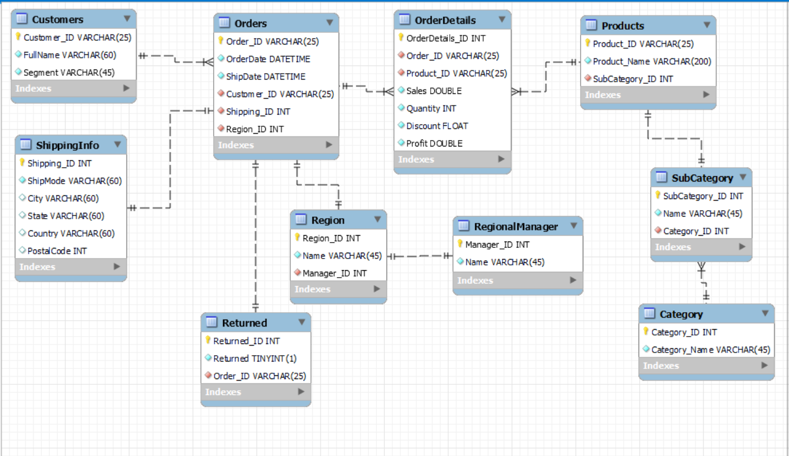
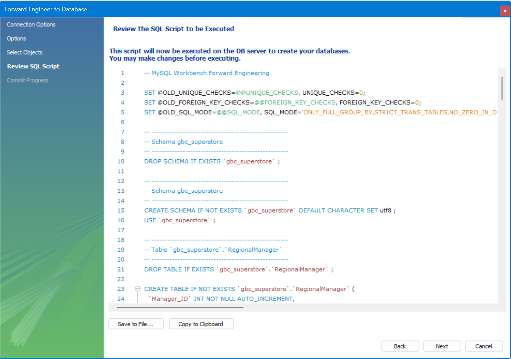

**Project Name:** Data Modelling - Sample Superstore

**Description:**
This GitHub project focuses on the development of a normalized database model (specifically targeting 3rd Normal Form - 3NF) using MySQL for Global Super Store, aiming to enhance the efficiency of their day-to-day operations.

**Project Goals:**
- **Eliminate Data Redundancy:** Minimize or eradicate redundant data to enhance database efficiency.
- **Optimize Data Usage:** Ensure optimal utilization of stored data.
- **Reduce Data Entry Errors:** Implement measures to minimize errors during data input, thereby preserving data validity.
- **Improve Data Consistency:** Enhance the consistency and reliability of stored data.

**Project Origin:**
Originally conceived as a class project at GBC, this endeavor aims to address real-world data management challenges encountered in operational environments.

**About the Data:**
The dataset is sourced from an Excel file, comprising three distinct sheets:
- **Orders:** Contains detailed information about each order, including products, customers, etc.
- **People:** Contains data pertaining to regional managers.
- **Returns:** Provides insights into orders that have been returned, including relevant details.

# ER-Diagram of Physical Model

This diagram represents the physical model of the database, showing the entities, their attributes, and the relationships between them.

# Workbench Forward Engineering

## TODO

- [ ] Perform a set of queries in SQL to test the database functionality.